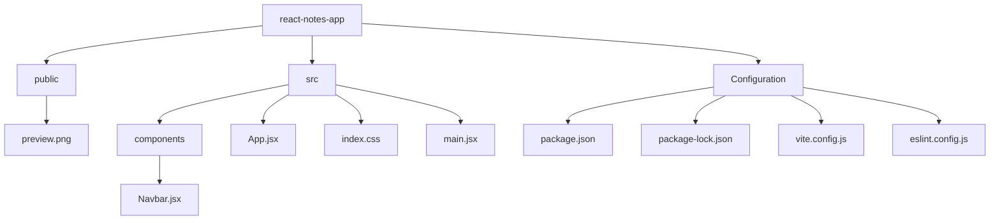
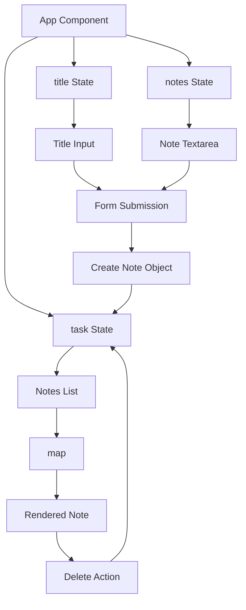

# NoteCraft — React Notes App

A responsive notes management interface built with **React and Tailwind CSS**. NoteCraft provides a focused workspace for creating, viewing, and managing notes through a clean dark-themed interface.

## Table of Contents

* [Preview and Live Demo](#preview-and-live-demo)
* [Features](#features)
* [Implementation](#implementation)
* [Project Structure](#project-structure)
* [Data Flow](#data-flow)
* [Tech Stack](#tech-stack)
* [Getting Started](#getting-started)
* [Documentation](#documentation)
* [Author](#author)

## Preview and Live Demo

[](https://hadiashah01.github.io/react-notes-app/)


## Features

* Create notes with a title and content
* Add notes dynamically without reloading the page
* Display recently created notes in the interface
* Delete notes directly from the notes list
* Controlled title and content inputs
* Conditional rendering for empty and populated note states
* Responsive layout across desktop, tablet, and mobile screens
* Dark-themed interface with a focused visual hierarchy
* Interactive buttons with responsive states
* Lucide React icons for interface actions

## Implementation

* **React State**

  * `useState` manages the title, note content, and notes collection.
  * State updates automatically reflect changes in the interface.

* **Controlled Inputs**

  * The title input and note textarea are connected to React state.
  * `onChange` handlers update their corresponding state values.

* **Form Handling**

  * The form uses `onSubmit` to handle note creation.
  * Default browser submission behavior is prevented.
  * A new note object is added to the notes array.
  * Input fields are reset after submission.

* **Dynamic Rendering**

  * Notes are stored as objects inside an array.
  * JavaScript `map()` generates the note interface dynamically.
  * Each note displays its title and content.

* **Delete Functionality**

  * The selected note is removed from the notes array.
  * The updated state immediately re-renders the notes list.

* **Conditional Rendering**

  * The interface displays a fallback message when no notes exist.
  * Notes are rendered once the collection contains items.

* **Responsive Interface**

  * Tailwind CSS responsive utilities adapt the layout for different screen sizes.
  * Spacing, typography, sizing, and positioning adjust across breakpoints.

* **Component Separation**

  * `Navbar.jsx` is maintained as a separate reusable component.
  * The main note functionality and state management remain in `App.jsx`.

## Project Structure



## Data Flow



## Tech Stack

* **React** — UI development and state management
* **JavaScript** — Application logic and dynamic rendering
* **Tailwind CSS** — Responsive utility-based styling
* **Vite** — Development environment and production builds
* **Lucide React** — Interface icons

## Getting Started

### Clone the repository

```bash
git clone https://github.com/hadiashah01/react-notes-app.git
cd react-notes-app
```

### Install dependencies

```bash
npm install
```

### Run locally

```bash
npm run dev
```

### Build for production

```bash
npm run build
```

## Documentation

* [React Documentation](https://react.dev/)
* [Vite Documentation](https://vite.dev/)
* [Tailwind CSS Documentation](https://tailwindcss.com/docs)
* [Lucide React Documentation](https://lucide.dev/guide/packages/lucide-react)
* [JavaScript Documentation](https://developer.mozilla.org/en-US/docs/Web/JavaScript)

## Author

**Hadia Shahjahan**

Frontend Developer focused on building responsive, modern, and user-friendly web interfaces.

* GitHub: [@hadiashah01](https://github.com/hadiashah01)
* LinkedIn: [Hadia Shahjahan](https://linkedin.com/in/hadia-shahjahan)
